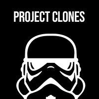

  

<h1 align="center">
  Project Clones
</h1>

A collection of real and existing company websites, cloned and built as accurately as possible using either Vanilla JS, React, Gatsby, or Next.js

## Projects (in progress)

- [Uber](https://www.uber.com/)
- [DoorDash](https://www.doordash.com/)
- [Stripe](https://stripe.com/)
- [Twilio](https://www.twilio.com/)
- [NerdWallet](https://www.nerdwallet.com/)
